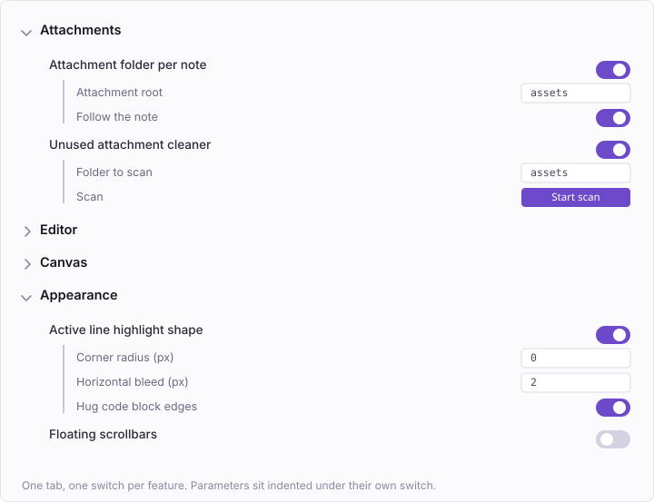

# LToolkit

**English** · [简体中文](README.zh-CN.md)

A bundle of small editing, attachment, and appearance tweaks for [Obsidian](https://obsidian.md).

Every feature is a separate toggle in one settings tab. Twenty-four of the thirty-four are on out of the box — everything under Editor and Attachments, plus eight appearance tweaks. The rest, including anything tied to a specific theme, start off. Features that take parameters show them indented under their own switch, and any commands a feature adds are listed there too, with the hotkey they are currently bound to.



---

## Attachments

- **Attachment folder per note** — New attachments go into a folder that mirrors the note's own path, so `stocks/analysis.md` gets `assets/stocks/analysis/`. Works for paste, drag & drop and the built-in *Download attachments for current file*, because all of them funnel through one Vault method. Filenames are left alone; duplicates keep Obsidian's own ` 1`, ` 2` suffixes.
  <br>*Options:* attachment root · move the folder along when the note is renamed or moved (links are updated, emptied folders are pruned).

- **Unused attachment cleaner** — Lists attachments that no note or canvas references, with thumbnails and sizes, and deletes only the ones you leave ticked. Deletion goes through `fileManager.trashFile`, so it honours whatever you chose under *Files and links → Deleted files*.
  <br>Three layers of detection, biased toward keeping files: Obsidian's resolved links, canvas node files parsed separately (they don't always land in the link index), and a full-text sweep that catches HTML ``, frontmatter and templates. A bare filename only counts when it isn't preceded by `/`, so `assets/a/demo.gif` no longer protects an unrelated `assets/demo.gif`.
  <br>*Options:* folder to scan. *Also available as a command.*

## Editor

- **Progressive select** — Notion-style <kbd>Cmd/Ctrl</kbd>+<kbd>A</kbd>. First press selects the line's text without its leading markup — no list bullet, no heading hashes, no quote prefix. Second press takes the whole block: the paragraph, the list item including its children, the code block, the blockquote. Third press falls through to Obsidian's own select-all. Tables stop at one level and select the cell you're in. In Reading view it selects the rendered block under the caret.

- **Esc selects the block** — Esc switches from *typing inside a block* to *this block is selected*, the way it does in Notion. Passes through when an autocomplete, menu or modal is open, stays out of the way in Vim mode, and passes through again once the block is already selected.

- **Toggle task list** — The right-click *Paragraph → Task list* action as a bindable command. Flips the current line, or every selected line, between `- [ ] text` and a plain paragraph. Obsidian's built-in `editor:toggle-checklist-status` only ticks existing tasks; the two complement each other.

- **Insert line above / below** — Sublime's <kbd>Cmd</kbd>+<kbd>Enter</kbd> and <kbd>Cmd</kbd>+<kbd>Shift</kbd>+<kbd>Enter</kbd>: open a new line below or above the current one and move the caret there, wherever the caret happens to sit — the current line is never split. Obsidian has no equivalent command; `swap-line-up/down` moves a whole line rather than inserting one, and CodeMirror's `insertBlankLine` is shadowed by *Open link in new tab* on <kbd>Mod</kbd>+<kbd>Enter</kbd> and only ever inserts a bare line. Indentation, quote prefixes and list markers carry over (ordered lists take the next number, tasks come back unchecked, headings do not carry); inside a code block only the indentation does. Bind both commands yourself under Hotkeys.

- **Clear paragraph markers** — Strips heading hashes, list bullets, task checkboxes and indentation from the start of the current line or selection, leaving it a plain paragraph. Inline bold and code are untouched, which is where this differs from *Clear formatting*.

- **Convert to table** — Splits the current line, or the selected lines, on spaces and tabs into a Markdown table. The first row becomes the header; a single line is padded out to three rows. On an empty line it hands off to Obsidian's *Insert table*.

- **Line to note, and back** — Pulls the current line out into its own note in the same folder and leaves a link behind. Run it again on that link and it reverses: the note's content comes back inline and the note goes to the trash.

- **Links to folders** — `[name](study/maths)`, where the parentheses hold a relative path, reads as a broken link everywhere when the path is a folder: the resolver behind it, `getFirstLinkpathDest`, only searches the file index, and folders aren't in it. This lines up the three places that get it wrong. Clicking reveals the folder in the file explorer — opening the sidebar if it's closed, expanding each parent, scrolling to it and selecting it, the same steps as the built-in *Reveal current file in navigation* — instead of trying to create a new file and reporting *Folder already exists*. Hovering no longer says *Unable to find file*; it lists what the folder holds, under the path with a trailing slash, indented two spaces beneath it. And the link stops being painted in the faded unresolved colour, so it looks like any other link. All three hook in after the link text is resolved, which is what makes Reading view and Live Preview behave the same — a Live Preview link isn't an `<a>` at all but a CodeMirror decoration, so hooking the DOM would only ever fix half of it. If the path doesn't resolve to a folder nothing happens, so ordinary file links are untouched. Wiki links, `[[study/maths]]`, work the same way. Toggling the switch redraws Reading view on its own; notes already open in Live Preview keep the old colour until they are reopened.

- **Remember scroll position** — Per-file scroll position, restored when you come back. Obsidian keeps that position on a *tab's navigation history* entry, so it only survives pressing Back — reopening the note from the file list starts at the top. Positions live in local storage keyed by vault, so sync plugins can't carry them between devices and overwrite each other.
  <br>*Options:* also restore the cursor and selection · restore delay for long notes.

- **Option-click opens in the side pane** — Hold Option and click a link, a file in the explorer, a search result, or a filename in a Bases table, and it always opens in whichever tab is currently showing in the second tab group: list on the left, the note on the right, and never more than two tab groups in the window. Obsidian's own Option+Cmd+click is *new split*, which carves off another group every time; the official way to get reuse is to split once by hand and then **pin** the left tab — pinning makes `canNavigate()` false, so Obsidian looks for another unpinned tab and lands on the right one, at the cost of the left tab no longer being able to navigate itself. This feature folds that behaviour into a modifier key, with nothing pinned. The patch sits on `Workspace.getLeaf` — links, the file explorer, search results, bookmarks, and Bases tables all funnel through that one fork, so one patch covers them all. Opening more tabs on the right is fine — the note goes into the one you are looking at; a split only happens when there is a single group. Option-clicking a link inside a note that is already on the right just navigates that tab in place, same as a plain click. Links work in Live Preview too: Obsidian ignores Option-clicks on editor links (it leaves Option to multiple cursors), so the plugin catches the `mousedown` on a rendered link and opens it itself. Option on its own does nothing in Obsidian (`Keymap.isModEvent` returns `false` for it), so no existing shortcut is taken, and only clicks landing on links or file items are routed — Option+click for multiple cursors in the editor still works anywhere off a link. The file explorer's own Option+click multi-select is taken over (it checks `defaultPrevented`, so the click is stopped in the capture phase and the plugin opens the file itself); Shift range-select still works.
  <br>*Options:* focus the side pane after clicking (off by default — keeping focus where it is lets you click straight down the list).

- **Option + wheel flips through the folder** — Rest the pointer on a tab, hold <kbd>Option</kbd> and scroll: that tab steps to the previous / next note in the same folder. The order follows the file explorer's sort setting, only files of the same type are visited, and it stops at either end. Made for one-note-a-day journals. *Desktop only.*

- **No duplicate tabs** — When a file is already open in the same tab group, switch to that tab instead of opening a second copy. The check lands before the open, not after: the file never reaches a second tab, so there is no flash and no view built for nothing, and a tab created just for this open is cleaned up. Search-result highlights and link subpaths ride along to the tab you land on. Only ever within one tab group — split panes comparing the same note are left alone.

- **Preview tabs** — VS Code's ephemeral tab, in Obsidian: single-clicking a file reuses one tab whose title is italic, so browsing through ten notes still costs one tab. Type in it, double-click the file, or pin the tab, and the title turns upright — it is yours now, and the next thing you browse opens in a fresh preview tab beside it instead of overwriting it. Obsidian's own rule is *always* reuse the current tab, whether or not you were writing in it. Anything that explicitly asks for a new tab — Cmd/Ctrl-click, split panes — is left alone, as are the sidebars. One preview tab per tab group at most.
  <br>*Options:* promote on edit.

- **Open notes in the default view** — Every note opens in whatever "Default view for new tabs" is set to in Obsidian's own settings, instead of inheriting the previous note's mode. Obsidian's view mode follows the *tab*, and that default only applies when a tab is created: switch A to editing, then click B in the file explorer, and B is in editing too. It shows up most with Preview tabs, where browsing happens in one tab anyway — one switch to editing and every note after it is in editing. Nothing is stored: a tab keeps its own mode for as long as it's open, and the note you're actually writing already sits in its own tab.

- **Cross-tab back and forward** — One navigation trail for the whole window: Back returns to the previous location and switches to whichever tab it was in. Obsidian keeps *one history per tab*, so finishing in tab A and opening a note in tab B leaves Back doing nothing — B's own history is empty and A's is invisible from there. The trail is one line with one file per slot — every new note you look at appends a slot, wherever it was opened. Pinned tabs 1, 2, 3 plus files 4, 5, 6 browsed in a fourth tab walk back as 5, 4, 3, 2, 1. Returning to a slot: if the file is open, switch to it (so it is never opened twice); if not, but the tab it last lived in is still there, open it there — handing off to the built-in history when its next entry is exactly that file, which restores scroll position and cursor; if that tab is gone too, reopen the file in the current tab. Closing a tab doesn't change the trail — the trail records what you looked at. Slots whose file is gone are skipped. A third command prints the whole trail and the current position to the console. The mouse's back and forward buttons, two-finger swipes, and the arrows at the top left of the tab bar all follow this trail by default — mouse buttons can't be bound in Obsidian's hotkey settings (those are keyboard-only), so the plugin takes them over at the `window.history.back` level, still yielding to Obsidian while a modal or menu is open. The two keyboard commands take no hotkey by default: Cmd/Ctrl+`[` and `]` are still bound to the built-in Back and Forward, so rebind them yourself if you want them.
  <br>*Options:* take over the mouse buttons and nav arrows.

- **Separate open from create** — The built-in quick switcher creates a note when Enter finds no match, and Shift+Enter creates one whether or not anything matched, so a quick keystroke leaves an empty file in the wrong folder; its settings have no way to turn that off. This splits it into two commands: *Quick open (no create)* lists existing files only, Enter only opens, and no match means nothing happens; *New note (type a path)* takes a path in a single input: it starts with the current note's folder filled in, <kbd>Tab</kbd> completes a folder and adds the trailing /, then you type the name and press Enter, with the full path shown live in the first row; missing folders are created along the way, and an existing note with that name is opened instead. Neither command takes a key — rebind <kbd>Cmd</kbd>+<kbd>P</kbd> to *Quick open*.
  <br>*Options:* include attachments in the list.
- **Toggle bookmark** — One command to add or remove the current note's bookmark, with no dialog. Obsidian's built-in *Bookmark* opens a dialog for an alias and a group, and un-bookmarking is a second command. Data still goes into Obsidian's own `bookmarks.json`.

## Canvas

- **Canvas mouse mode swap** — Figma-style canvas navigation: left-drag pans, the wheel zooms. Hold <kbd>Space</kbd> to get marquee select and normal scrolling back. *Desktop only.*

## Appearance

- **Unified sidebar background** — Makes the left and right sidebars share the editor's background instead of the theme's secondary colour, or any colour you pick. Scoped to the sidebar splits, so the editor and its own tab bar are untouched.
  <br>*Options:* follow the editor background (adapts to light and dark on its own) · custom colour.

- **Active line highlight shape** — Corner radius and horizontal bleed for the highlight your theme draws on the cursor's line. The bleed is painted with `box-shadow` rather than padding, so the text never shifts — and code block lines, whose background *is* the line's own background, keep their edges flush.
  <br>*Options:* radius · bleed in pixels · hug code block edges.

- **Code block top bleed** — In Live Preview a code block's background is painted line by line, so the block's top edge is exactly the first line of text and the code sits tight against it. This adds a few pixels of the same colour above, rounded to match `--code-radius`.
  <br>*Options:* size in pixels.

- **Code block filename & language** — Write the filename after the language and it shows in the code block's top-left corner:

  ````markdown
  ```python ~/sshd.conf
  ```
  ````

  Obsidian keeps only the first word of the info string, so the name is read back from the source. Works in both views: Reading view gets a header row, and in Live Preview — where Obsidian collapses the fence line while the cursor is elsewhere — the name is filled back in via a CodeMirror line decoration.
  <br>*Options:* also show the language label in Reading view, which normally only Live Preview has (it steps aside on hover so the copy button can take its place).

- **Collapse long code blocks** — In Reading view, a code block taller than N lines shows only its first N — measured as rendered, so a single wrapped line thousands of characters long counts too — fades out at the bottom and gets an *Expand* button (which then turns into *Collapse*). Expanded blocks stay expanded while the file is open — re-renders and trips through Editing view don't reset them — and are forgotten once it's closed. Adding or removing lines above a block also puts it back to collapsed. Live Preview is left alone: its code blocks are painted line by line, with no container whose height could be capped.
  <br>*Options:* number of lines.

- **Flat code background** — Replaces the Border theme's dotted texture on code blocks, inline code, blockquotes and table headers with a flat fill. *Theme-specific.*

- **Body line height** — A line-height multiplier for both Reading view and the editor. Obsidian has no core setting for this and themes usually leave it to Style Settings; this keeps it with you when you change themes.
  <br>*Options:* multiplier (1–3).

- **Consistent Reading/Editing view** — Reading view's block spacing is a hard-coded `--p-spacing` (1rem), while in the editor the blank line between paragraphs is a real line whose height is line-height × font size — so the higher the line height, the further apart the two views drift. This makes Reading view's block spacing equal one blank line, and paragraphs, headings, lists, tables, code blocks, quotes and callouts all follow. Headings no longer get extra breathing room on either side: spacing comes purely from how many blank lines the source has. Where the source has no blank line between two blocks (a sentence ending in a colon followed straight by a list, say), Reading view leaves no gap either — that part needs a post-processor to read the source line numbers, since CSS cannot see the file. Blockquote height and left indent, and underlines on links to vault files, are matched too. *Theme-dependent.*

- **Rule under the properties** — Draws a horizontal line between a note's properties and its body. Obsidian exposes every variable for this block but ships them all off: `--metadata-background` is transparent and `--metadata-border-width` is 0, so the properties sit on exactly the same background as the body with nothing marking where they end — which also makes it impossible to tell whether the gap below them is the block's own padding or a real blank line in the source. The space above and below the line is the same amount: above is the distance from the "Add property" row to the line, and below repeats it. Both views land the same distance from the body, which in Reading view means zeroing the first block's own paragraph spacing — otherwise it comes out a full line lower than editing view.

- **Editing-view left rule** — Draws a vertical line down the far left of a note in editing view, and nothing in Reading view. The closer the two views look the harder they are to tell apart at a glance — especially with the parity tweak above turned on. Editing view is detected from the leaf's `data-mode` attribute (`source` covers both Live Preview and Source mode). Testing for a `.markdown-source-view` element does not work: Obsidian's `setMode()` only hides the outgoing view, so both views stay in the DOM the whole time. The line lives on the whole leaf's `::before` rather than inside the content area: the view header is a sibling of the content area, so a line drawn inside it starts below the header with a gap above; an inset shadow won't do either, since the header's own background paints over it.
  <br>*Parameters:* line colour.

- **Per-level heading colours** — Pick a colour for the note title and for each of the six heading levels. Obsidian drives both views and the inline title from the same `--inline-title-color` / `--h1-color`…`--h6-color`, so redefining those variables is enough for Reading view and Live Preview to follow together.
  <br>*Options:* note title · headings 1–6, seven colour pickers.

- **Square, detached tabs** — Turns the main tab bar's browser-style connected tabs into separate square chips: radius flattened, the decorative curves that weld the active tab to the note removed, and the active background moved to the inner element so each tab sits clear of its neighbours and of the content below.
  <br>*Options:* derive the shade from the editor background — darker in light mode, lighter in dark mode — or pick a colour · shade depth.

- **Floating scrollbars** — Removes the scrollbar's track fill and the divider line beside the text, leaving only the thumb. On macOS the scrollbar is the native one, so the only lever is `scrollbar-color`; a transparent track drops the divider along with the fill, and shows whatever surface is behind it, which is correct in the editor and in both sidebars.

- **Fix caret on empty indented lines** — After pressing <kbd>Tab</kbd> on a line you haven't typed on yet, the caret sits about ten pixels left of where the character actually lands, then jumps right on the first keystroke. Those lines aren't yet treated as list continuations, so they miss the `tab-size` Obsidian gives list lines; restoring it fixes the offset. Code blocks are unaffected.

- **File icons** — Puts an icon in front of every file in the sidebar's file tree. Obsidian draws a collapse arrow on folders but nothing at all on files, so the tree reads as one column of text. Files only — a folder already has its arrow, and a second marker on it is redundant — and one icon for all of them, not one per extension. The icon takes no space in the row: it drops into the slot where a sibling folder's collapse arrow sits, so filenames stay aligned with folder names instead of being pushed right by their own icon. It takes its colour from the text, so selection and hover carry it along and neither theme needs its own version.

- **Link text in code takes the link colour** — Write a link's text as inline code — ``[`40-archive/`](../40-archive)`` — and it renders in the code colour, not the link colour: core pins `--code-normal` on inline code, and that wins over the link colour. So one note ends up with `[vision](...)` in the accent colour and ``[`40-archive/`](...)`` in another, as if they were different kinds of thing; Typewriter maps `--code-normal` to blue, which makes the clash loud. This colours it like the link it is, leaving the background, border, size and radius alone, so it still reads as code. Both Reading view and Live Preview.

- **Hide the file explorer's tab bar** — After splitting a sidebar, the pane holding the file explorer gets a tab bar with a single icon in it, costing a row of height. This reclaims it. The *new file / sort* row and the sidebar collapse button stay. Only applies while the file explorer is the sole tab in its group, so dragging another pane in brings the bar back.

- **Fix folder expand animation** — In the Border theme, expanding a folder for the first time animates the height to a value that's too small and then snaps to the real one. *Theme-specific.*

---

## Install

**From the community plugin browser** — not yet; the submission is pending.

**Manually** — download `main.js`, `manifest.json` and `styles.css` from the [latest release](https://github.com/lee112358/ltoolkit/releases/latest) into `<vault>/.obsidian/plugins/ltoolkit/`, then enable *LToolkit* under *Settings → Community plugins*.

**With [BRAT](https://github.com/TfTHacker/obsidian42-brat)** — add `lee112358/ltoolkit` as a beta plugin.

## Build from source

```bash
npm install
npm run build     # bundle and install into the vault at $OBSIDIAN_VAULT
npm run dev       # same, rebuilding on change
npm run dist      # bundle into dist/ for a release
npm run format    # prettier
```

`build.mjs` reads the install folder from `manifest.json`'s `id`, and takes the vault path from `OBSIDIAN_VAULT`.

Each feature is one entry in `src/features/index.js`: an id, a group, the settings copy, and either a `create()` returning a `Component` or just a `bodyClass` for the CSS-only ones. Adding a feature means adding an entry — the settings tab builds itself from that array.

## License

[MIT](LICENSE)
