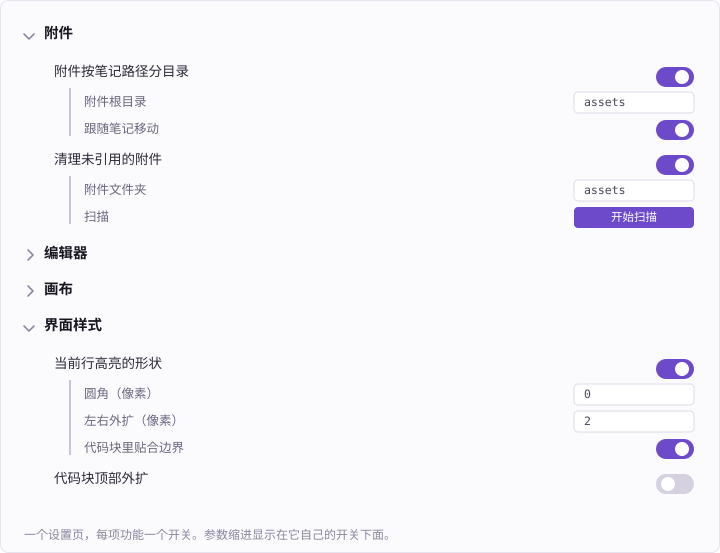

# LToolkit

[English](README.md) · **简体中文**

一组针对 [Obsidian](https://obsidian.md) 的小改造，涵盖编辑、附件和界面。

每项功能在同一个设置页里各有一个独立开关。24 项里装上默认开 17 项——「编辑器」和「附件」全部，加「界面样式」里 5 项；其余默认关着，包括几个只对特定主题有意义的。带参数的功能，参数缩进显示在它自己的开关下面；功能带来的命令也一并列在那里，附当前绑定的快捷键。



---

## 附件

- **附件按笔记路径分目录** — 新附件存进与笔记路径对应的目录，`股票/珍大户.md` 的图片就进 `assets/股票/珍大户/`。粘贴、拖入和内置的「下载当前文件内的所有附件」都生效——它们最终都汇到同一个 Vault 方法上，接管这一处就全覆盖了。文件名不改，重名沿用 Obsidian 自己的 ` 1`、` 2` 规则。
  <br>*参数：*附件根目录 · 笔记移动或改名时附件目录跟着搬（链接一并更新，搬空的目录逐级回收）。

- **清理未引用的附件** — 列出没有被任何笔记或画布引用的附件，带缩略图和体积，只删你留着勾的。删除走 `fileManager.trashFile`，遵循你在「文件与链接 → 已删除文件」里选的方式。
  <br>判定分三层，一律偏向少删：Obsidian 解析出的链接、单独解析的画布节点文件（它们不一定进链接索引）、以及全文兜底扫描，用来捞 HTML ``、frontmatter 和模板这类索引不到的写法。只有文件名的匹配要求前面不是斜杠，所以 `assets/a/demo.gif` 不会再把无关的 `assets/demo.gif` 保下来。
  <br>*参数：*扫描的文件夹。*也可在命令面板执行。*

## 编辑器

- **渐进全选** — Notion 式的 <kbd>Cmd/Ctrl</kbd>+<kbd>A</kbd>。第一次选当前行的正文，不含行首标记——没有列表符号、没有井号、没有引用前缀。第二次选整块：整段、整个列表项含子项、整个代码块、整个引用块。第三次才交回 Obsidian 自己的全选。表格只做一级，选中光标所在的那一格。阅读模式下选中光标所在的渲染块。

- **Esc 选中整块** — Esc 把「在块里打字」切成「选中这个块」，和 Notion 一样。有自动补全、菜单或弹窗时放行，开着 Vim 模式时不接管，整块已经选中了再按一次也放行。

- **切换任务列表** — 把右键菜单「段落 → 任务列表」做成可绑定快捷键的命令。光标所在行或选中的多行在 `- [ ] 内容` 和普通段落之间来回切。内置的 `editor:toggle-checklist-status` 只负责勾选已有任务，两者互补。

- **上下插入新行** — Sublime 的 <kbd>Cmd</kbd>+<kbd>Enter</kbd> 和 <kbd>Cmd</kbd>+<kbd>Shift</kbd>+<kbd>Enter</kbd>：不管光标在行中间哪个位置，都在当前行的下方或上方另起一行并把光标移过去，当前行一个字都不切开。Obsidian 没有对应的内置命令——`swap-line-up/down` 是搬走整行不是插入，CodeMirror 的 `insertBlankLine` 又被「在新标签页打开链接」占了 <kbd>Mod</kbd>+<kbd>Enter</kbd>，而且它只插纯空行。缩进、引用前缀和列表标记会带到新行上（有序列表接下一个号，任务项延续成未勾选，标题不延续），代码块里只带缩进。两条命令都要自己去快捷键里绑键。

- **清除段落标签** — 把当前行或选中多行行首的标题井号、列表标记、任务复选框和缩进一并去掉，还原成普通段落。正文里的加粗、行内代码不受影响——这正是它和「清除格式」的区别。

- **转换为表格** — 把当前行或选中的多行按空格 / Tab 切成表格。第一行当表头，单行时补足三行。光标所在行是空的就转交内置的「插入表格」。

- **当前行转成笔记 / 收回** — 把当前行的文字抽成一篇独立笔记，建在同一目录下，本行换成指向它的链接。在链接行上再执行一次则反过来：笔记内容取回来铺在本行下面，笔记移入废纸篓。

- **记住笔记的浏览位置** — 按文件记住滚动位置，切走再切回来回到原处。Obsidian 自己把位置存在**标签页的导航历史**条目上，所以只有按「返回」才恢复，从文件列表重新打开就回到顶部。位置存在按 vault 隔离的本机存储里，同步插件带不走，不会在多台设备之间互相覆盖。
  <br>*参数：*同时恢复光标和选区 · 长笔记的恢复延迟。

- **同一标签组不重复打开** — 已经有标签页开着这个文件时切过去用那个，而不是再开一份。你原来那个标签有历史就退回上一篇，是为此新建的就关掉。只在同一标签组内生效，左右分栏对照看同一篇不受影响。

- **切换书签（当前笔记）** — 一条命令加或取消当前笔记的书签，不弹窗。内置的「添加书签」会弹窗让你填别名和分组，取消书签还是另一条命令。数据仍然写进 Obsidian 官方的 `bookmarks.json`。

## 画布

- **Canvas 鼠标模式对调** — Figma 式的画布操作：左键拖动平移，滚轮缩放。按住 <kbd>空格</kbd> 恢复框选与上下滚动。*仅桌面端。*

## 界面样式

- **统一侧边栏背景色** — 让左右侧边栏用编辑区的底色，而不是主题的次级色；也可以自己挑一个。作用范围限定在侧边栏内，编辑区和它自己的标签栏不受影响。
  <br>*参数：*跟随编辑区背景色（明暗模式各自都对得上） · 自定义颜色。

- **当前行高亮的形状** — 调主题给光标所在行画的那块底色的圆角和左右外扩。外扩用 `box-shadow` 画而不是 padding，所以文字一个像素都不动；代码块行的底色就是行自己的底色，因此单独收成贴边，不会顶出代码块。
  <br>*参数：*圆角 · 左右外扩像素 · 代码块里贴合边界。

- **代码块顶部外扩** — 实时预览里代码块的底色是逐行铺的，块的上边界就是第一行文字的上边界，字顶着边。这里在上方补一条同色窄条，圆角跟着 `--code-radius` 走。
  <br>*参数：*向上外扩的像素。

- **代码块的文件名与语言** — 在语言后面写上文件名，它就显示在代码块左上角：

  ````markdown
  ```python ~/sshd.conf
  ```
  ````

  Obsidian 只保留 info string 的第一个词，所以名字得从原文里读回来。两种视图都生效：阅读视图加一行标题；实时预览下光标不在块里时 Obsidian 会折叠围栏行，这时用 CodeMirror 的行装饰把名字补回去。
  <br>*参数：*阅读视图也显示语言标签——那颗标签本来只有实时预览才有（鼠标移上去时它让位给内置的复制按钮）。

- **代码块纯色背景** — 用平整的浅灰底替换 Border 主题在代码块、行内代码、引用块和表头上的点阵纹理。*主题相关。*

- **正文行高** — 阅读视图和编辑器的正文行高倍数。Obsidian 核心设置里没有这一项，主题通常丢给 Style Settings；放在这里，换主题也带得走。
  <br>*参数：*行高倍数（1–3）。

- **编辑区标签页直角分离** — 把主编辑区那排浏览器式的「连体标签」改成一块块独立的直角小方块：抹平圆角，去掉把激活标签和正文焊在一起的装饰弧线，底色从撑满整条标签栏的外层挪到带内边距的内层，于是每个标签四面不贴边，彼此也留缝。
  <br>*参数：*底色跟着编辑区自动算（亮色模式加深、暗色模式提亮）或自己挑 · 加深幅度。

- **悬浮滚动条** — 去掉滚动条轨道的底色和紧贴正文那条分界线，只留滑块。macOS 上走的是原生滚动条，唯一的抓手是 `scrollbar-color`；把轨道设成透明，底色和那条线一起消失，透出来的正是它背后那块底色——编辑区和左右侧边栏因此各自都对。

- **修复空缩进行的光标位置** — 在还没打字的行上按 <kbd>Tab</kbd>，光标比字符实际的落点偏左十来个像素，一打字就往右跳一下。原因是这一行还没被判定成列表续行，拿不到 Obsidian 给列表行设的 `tab-size`，补上即可。代码块不受影响。

- **隐藏文件浏览器的标签栏** — 侧边栏上下分栏后，装着文件浏览器的那个面板会多出一条只放着一个图标的标签栏，白占一行高度。隐藏它把高度还给文件列表；「新建 / 排序」那一行和折叠侧边栏的按钮都保留。只在该标签组里仅有文件浏览器一个标签时生效，拖别的面板进来标签栏会自动回来。

- **修复文件夹展开动画** — Border 主题下，文件树首次展开文件夹时高度动画会先缩到一个偏小的目标再弹到实际高度。*主题相关。*

---

## 安装

**社区插件市场** — 暂未上架，提交审核中。

**手动安装** — 从 [最新 release](https://github.com/lee112358/ltoolkit/releases/latest) 下载 `main.js`、`manifest.json`、`styles.css` 放进 `<vault>/.obsidian/plugins/ltoolkit/`，然后在「设置 → 第三方插件」里启用 *LToolkit*。

**用 [BRAT](https://github.com/TfTHacker/obsidian42-brat)** — 添加 `lee112358/ltoolkit` 作为 beta 插件。

## 从源码构建

```bash
npm install
npm run build     # 打包并装进 $OBSIDIAN_VAULT 指向的 vault
npm run dev       # 同上，改动即重建
npm run dist      # 打包到 dist/，用作 release 附件
npm run format    # prettier
```

`build.mjs` 从 `manifest.json` 的 `id` 推出安装目录，vault 路径取自环境变量 `OBSIDIAN_VAULT`。

每项功能就是 `src/features/index.js` 里的一条：一个 id、一个分组、设置页的文案，外加一个返回 `Component` 的 `create()`——纯 CSS 的功能只要一个 `bodyClass`。加功能 = 往这个数组里加一条，设置页会自己长出来。

## 许可证

[MIT](LICENSE)
